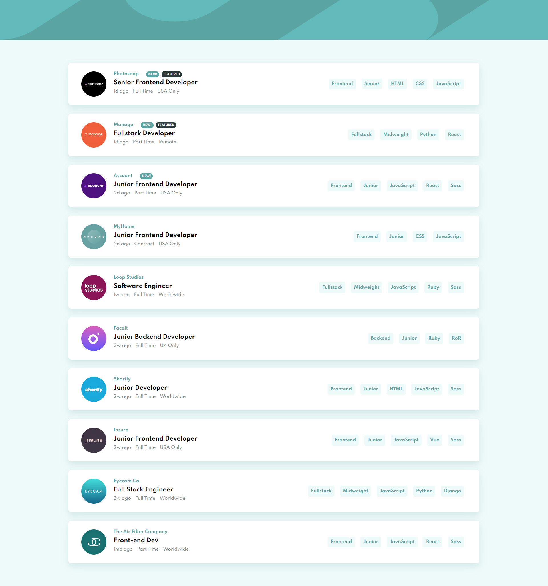
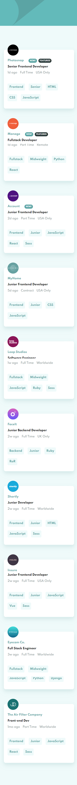

# Frontend Mentor : Job Listings With Filtering

⭐완성된 Challenges : https://yuuujin97.github.io/Job-Listings-With-Filtering/

---

## [Frontend Mentor](https://www.frontendmentor.io/challenges) Challenges란

주어진 style-guide를 통해 design 폴더에 있는 설계와 최대한 비슷하게 만드는 것입니다.

design 폴더 안에는 mobile 버전과 desktop 버전의 디자인이 있고,
style-guide 문서에는 색상표, 글꼴 등 필요한 정보가 담겨있습니다.
font size, padding , margin 등은 스타일에 맞게 정의 해야합니다.

---

### 구현된 기능

- 반응형 웹 디자인 추가
- 마우스 hover 상태 추가
- Json Data를 이용하여 리스트 출력
- 필터링 기능 추가
- 태그 선택 시 필터링 된 리스트로 업데이트

### Built with

- Semantic HTML5 markup
- CSS custom properties
- Sass / Scss Modules
- JavaSctipt
- Flexbox

### Screenshot

Desktop ver.

Mobile ver.

